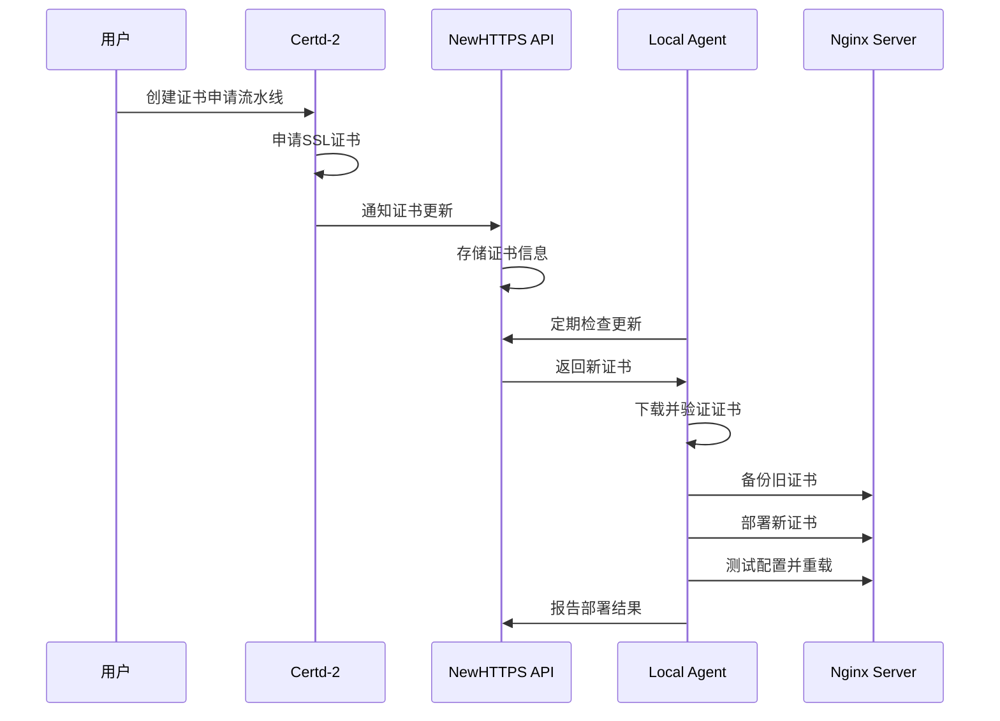
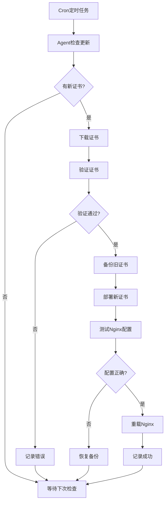

# NewHTTPS 实现说明

## 项目概述

NewHTTPS 是一个结合了 **Certd-2** 证书申请能力和 **httpsok.sh** 本地部署能力的混合SSL证书自动化管理系统。该项目成功解决了用户提出的需求：将两个优秀的工具结合起来，实现完整的SSL证书自动化管理流程。

## 核心设计理念

### 1. 混合架构设计
```
┌─────────────────┐    ┌─────────────────┐    ┌─────────────────┐
│   Certd-2       │    │  NewHTTPS API   │    │ Local Agent     │
│   证书申请层     │◄──►│   中间协调层     │◄──►│ 本地部署层       │
└─────────────────┘    └─────────────────┘    └─────────────────┘
```

- **Certd-2**：负责证书申请、管理和存储
- **NewHTTPS API**：作为中间层，协调证书分发和Agent管理
- **Local Agent**：基于httpsok.sh的思想，负责本地证书部署

### 2. 保持原有优势
- **Certd-2 的优势**：强大的证书申请能力、多CA支持、Web界面管理
- **httpsok.sh 的优势**：本地部署的可靠性、Nginx配置解析、备份机制

## 技术实现

### 1. API 中间层 (TypeScript + Express)

**核心文件结构：**
```
newhttps/api/
├── src/
│   ├── index.ts              # 主入口文件
│   ├── services/
│   │   ├── certdClient.ts    # Certd-2 客户端
│   │   └── database.ts       # SQLite 数据库服务
│   ├── routes/
│   │   ├── cert.ts           # 证书管理路由
│   │   ├── agent.ts          # Agent 管理路由
│   │   └── config.ts         # 配置管理路由
│   ├── middleware/
│   │   ├── auth.ts           # JWT 认证中间件
│   │   └── errorHandler.ts   # 错误处理中间件
│   └── utils/
│       └── logger.ts         # 日志工具
├── package.json
├── tsconfig.json
├── Dockerfile
└── .env.example
```

**主要功能：**
- 与 Certd-2 API 集成，获取证书信息
- Agent 注册和管理
- 证书更新检查和分发
- 活动日志记录
- JWT 认证和权限控制

### 2. 本地 Agent (Bash Script)

**核心文件：**
```
newhttps/agent/
└── newhttps-agent.sh         # 主Agent脚本 (924行)
```

**主要功能模块：**
- **系统检测**：自动检测操作系统、Nginx版本和配置
- **配置解析**：解析Nginx配置文件，提取SSL证书路径
- **证书管理**：下载、验证、备份和部署证书
- **自动化**：支持cron定时任务，自动检查更新
- **日志记录**：详细的操作日志和错误处理

**核心函数：**
- `_parse_nginx_config()`: 解析Nginx配置（借鉴httpsok.sh）
- `_check_cert_updates()`: 检查证书更新
- `_download_cert()`: 下载新证书
- `_deploy_cert()`: 部署证书到指定位置
- `_backup_cert()`: 备份现有证书
- `_reload_nginx()`: 安全重载Nginx

### 3. Certd-2 插件扩展

**插件文件：**
```
newhttps/plugins/newhttps-deploy/
├── src/
│   └── index.ts              # NewHTTPS部署插件
├── package.json
└── tsconfig.json
```

**插件功能：**
- 集成到Certd-2流水线系统
- 支持多Agent批量部署
- 可配置的部署策略
- 失败重试和通知机制

## 工作流程

### 1. 证书申请流程


### 2. 自动化部署流程


## 核心特性

### 1. 安全性
- **JWT认证**：API访问控制
- **证书验证**：下载后验证证书有效性
- **备份机制**：部署前自动备份现有证书
- **权限控制**：Agent运行权限最小化

### 2. 可靠性
- **错误处理**：完善的错误捕获和处理
- **重试机制**：网络失败自动重试
- **配置测试**：部署后测试Nginx配置
- **回滚机制**：失败时自动恢复备份

### 3. 可扩展性
- **插件架构**：支持Certd-2插件扩展
- **多Agent支持**：一个API可管理多个Agent
- **配置灵活**：支持多种部署策略
- **API开放**：RESTful API便于集成

### 4. 易用性
- **一键安装**：提供快速安装脚本
- **Web界面**：继承Certd-2的Web管理界面
- **命令行工具**：Agent提供完整的CLI接口
- **详细日志**：便于问题诊断和监控

## 部署方案

### 1. Docker Compose 部署（推荐）
```yaml
version: '3.8'
services:
  certd:                    # Certd-2 服务
  newhttps-api:            # NewHTTPS API 服务
  nginx:                   # 反向代理（可选）
```

### 2. 独立部署
- API服务：Node.js + TypeScript
- Agent：Bash脚本，支持多种Linux发行版
- 数据库：SQLite（轻量级）

### 3. 集群部署
- 支持多个API实例负载均衡
- Agent可连接到任意API实例
- 数据库可升级到PostgreSQL/MySQL

## 配置管理

### 1. API配置
```bash
# 环境变量配置
PORT=3000
CERTD_BASE_URL=http://localhost:7001
JWT_SECRET=your-secret-key
DATABASE_PATH=./data/newhttps.db
```

### 2. Agent配置
```bash
# Agent配置文件
NEWHTTPS_API_URL="http://localhost:3000"
NEWHTTPS_AGENT_ID="unique-agent-id"
NEWHTTPS_TOKEN="api-token"
CHECK_INTERVAL=3600
```

## 监控和维护

### 1. 健康检查
- API健康检查端点：`/health`
- Agent状态检查：`--status`参数
- 数据库连接监控

### 2. 日志系统
- API日志：结构化JSON日志
- Agent日志：详细的操作日志
- 错误追踪：完整的错误堆栈

### 3. 性能监控
- API响应时间监控
- Agent执行时间统计
- 证书更新成功率

## 与原项目的关系

### 1. 对Certd-2的扩展
- **无侵入性**：不修改Certd-2核心代码
- **插件集成**：通过插件方式集成
- **API兼容**：使用Certd-2现有API

### 2. 对httpsok.sh的改进
- **保留核心逻辑**：Nginx配置解析、证书部署
- **增强功能**：API集成、自动化管理
- **提升可靠性**：更好的错误处理和日志

### 3. 新增价值
- **统一管理**：Web界面统一管理多个服务器
- **自动化流程**：完整的证书生命周期管理
- **企业级特性**：认证、授权、审计、监控

## 总结

NewHTTPS成功实现了用户的需求，将Certd-2的强大证书申请能力与httpsok.sh的可靠本地部署能力完美结合。通过精心设计的架构，既保持了两个原项目的优势，又增加了企业级的管理和监控功能。

该项目不仅解决了SSL证书自动化管理的技术问题，更提供了一个可扩展、可维护的解决方案，适合从个人网站到企业级应用的各种场景。
