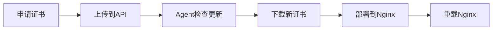

# NewHTTPS 使用指南

## 概述

NewHTTPS 提供了三种主要的使用方式：

1. **独立使用**：直接使用 NewHTTPS API 和 Agent
2. **与 Certd-2 集成**：在 Certd-2 流水线中使用 NewHTTPS 插件
3. **混合模式**：结合两种方式的优势

## 独立使用模式

### 1. 基本工作流程



### 2. 手动证书管理

#### 上传证书到 API

```bash
# 使用 curl 上传证书
curl -X POST http://your-api:3000/api/v1/cert/upload \
  -H "Authorization: Bearer your-token" \
  -F "domain=example.com" \
  -F "cert=@certificate.crt" \
  -F "key=@private.key"
```

#### 触发 Agent 更新

```bash
# 在目标服务器上手动运行
./newhttps-agent.sh --run
```

### 3. 自动化部署

Agent 会根据配置的时间间隔自动检查证书更新：

```bash
# 查看 cron 任务
crontab -l | grep newhttps

# 手动测试自动化流程
./newhttps-agent.sh --run --debug
```

## 与 Certd-2 集成模式

### 1. 创建证书申请流水线

在 Certd-2 Web 界面中：

1. **创建新流水线**
2. **添加证书申请任务**：
   - 选择 CA 提供商（Let's Encrypt、ZeroSSL 等）
   - 配置域名验证方式
   - 设置域名列表

3. **添加 NewHTTPS 部署任务**：
   - 插件类型：选择 "NewHTTPS 部署"
   - API URL：输入 NewHTTPS API 地址
   - API Token：输入认证令牌
   - 目标 Agent：选择要部署的 Agent

### 2. 流水线配置示例

```yaml
# 流水线配置示例
name: "自动SSL证书申请和部署"
tasks:
  - name: "申请证书"
    type: "CertApply"
    config:
      ca: "letsencrypt"
      domains: ["example.com", "www.example.com"]
      challenge: "dns-01"
      
  - name: "部署到NewHTTPS"
    type: "NewHttpsDeploy"
    config:
      apiUrl: "http://your-api:3000"
      apiToken: "your-token"
      targetAgents: ["agent1", "agent2"]
      deployMode: "selective"
      backupEnabled: true
      testAfterDeploy: true
```

### 3. 定时任务配置

设置流水线定时运行：

- **运行频率**：建议每天检查一次
- **续期时间**：证书到期前 30 天自动续期
- **失败重试**：配置重试策略

## 高级使用场景

### 1. 多服务器部署

#### 场景：一个证书部署到多台服务器

```bash
# 在每台服务器上安装 Agent
for server in server1 server2 server3; do
  ssh $server "wget https://raw.githubusercontent.com/your-repo/newhttps/main/agent/newhttps-agent.sh"
  ssh $server "chmod +x newhttps-agent.sh && ./newhttps-agent.sh --install"
done
```

#### 配置流水线部署到所有服务器

```yaml
- name: "部署到所有服务器"
  type: "NewHttpsDeploy"
  config:
    deployMode: "all"  # 部署到所有活跃的 Agent
    backupEnabled: true
```

### 2. 蓝绿部署

#### 场景：先部署到测试环境，验证后部署到生产环境

```yaml
# 第一阶段：部署到测试环境
- name: "部署到测试环境"
  type: "NewHttpsDeploy"
  config:
    targetAgents: ["test-agent1", "test-agent2"]
    testAfterDeploy: true

# 第二阶段：部署到生产环境（需要手动确认）
- name: "部署到生产环境"
  type: "NewHttpsDeploy"
  config:
    targetAgents: ["prod-agent1", "prod-agent2"]
    requireApproval: true
```

### 3. 条件部署

#### 根据域名或证书类型选择不同的部署策略

```bash
# Agent 配置文件中设置条件
# ~/.newhttps/config
DEPLOY_RULES='[
  {
    "domain_pattern": "*.example.com",
    "target_path": "/etc/nginx/ssl/example/",
    "reload_command": "systemctl reload nginx"
  },
  {
    "domain_pattern": "*.test.com", 
    "target_path": "/etc/nginx/ssl/test/",
    "reload_command": "docker exec nginx nginx -s reload"
  }
]'
```

## 监控和维护

### 1. 监控 Agent 状态

```bash
# 查看所有 Agent 状态
curl -H "Authorization: Bearer your-token" \
  http://your-api:3000/api/v1/agent/list

# 查看特定 Agent 的活动日志
curl -H "Authorization: Bearer your-token" \
  http://your-api:3000/api/v1/agent/agent-id/activities
```

### 2. 证书状态监控

```bash
# 检查证书到期时间
./newhttps-agent.sh --check-expiry

# 查看证书详细信息
openssl x509 -in /path/to/certificate.crt -text -noout
```

### 3. 日志分析

```bash
# 查看 API 日志
tail -f logs/newhttps-api.log

# 查看 Agent 日志
tail -f ~/.newhttps/newhttps-agent.log

# 过滤错误日志
grep "ERROR" ~/.newhttps/newhttps-agent.log
```

## 故障处理

### 1. 证书部署失败

```bash
# 检查 Agent 状态
./newhttps-agent.sh --status

# 手动测试部署
./newhttps-agent.sh --run --debug

# 检查 Nginx 配置
nginx -t

# 查看详细错误
tail -n 50 ~/.newhttps/newhttps-agent.log
```

### 2. Agent 连接问题

```bash
# 测试 API 连接
curl -v http://your-api:3000/health

# 检查网络连接
ping your-api-server

# 验证认证
curl -H "Authorization: Bearer your-token" \
  http://your-api:3000/api/v1/agent/test-connection
```

### 3. 证书验证失败

```bash
# 验证证书链
openssl verify -CAfile ca-bundle.crt certificate.crt

# 检查证书和私钥匹配
openssl x509 -noout -modulus -in certificate.crt | openssl md5
openssl rsa -noout -modulus -in private.key | openssl md5

# 测试 SSL 连接
openssl s_client -connect your-domain:443 -servername your-domain
```

## 最佳实践

### 1. 安全配置

- 使用强密码和 API Token
- 定期轮换认证凭据
- 限制 API 访问 IP 范围
- 启用 HTTPS 传输

### 2. 备份策略

- 自动备份证书文件
- 定期备份配置文件
- 保留多个版本的备份

### 3. 监控告警

- 设置证书到期告警
- 监控 Agent 心跳状态
- 配置部署失败通知

### 4. 测试验证

- 定期测试证书自动续期
- 验证备份恢复流程
- 测试故障切换机制

## 性能优化

### 1. Agent 优化

```bash
# 调整检查频率
CHECK_INTERVAL=7200  # 2小时检查一次

# 启用并发部署
CONCURRENT_DEPLOY=true
MAX_CONCURRENT=3
```

### 2. API 优化

```bash
# 调整数据库连接池
DB_POOL_SIZE=10

# 启用缓存
ENABLE_CACHE=true
CACHE_TTL=300
```

### 3. 网络优化

- 使用 CDN 加速 Agent 下载
- 配置本地镜像仓库
- 优化网络路由

## 扩展开发

### 1. 自定义 Agent 插件

```bash
# 创建自定义处理脚本
cat > ~/.newhttps/custom-handler.sh << 'EOF'
#!/bin/bash
# 自定义证书处理逻辑
domain="$1"
cert_file="$2"
key_file="$3"

# 在这里添加自定义逻辑
echo "Processing certificate for $domain"
EOF

chmod +x ~/.newhttps/custom-handler.sh
```

### 2. API 扩展

参考 [API 文档](api.md) 了解如何扩展 API 功能。

### 3. 集成第三方服务

- Webhook 通知
- 监控系统集成
- 日志聚合服务
